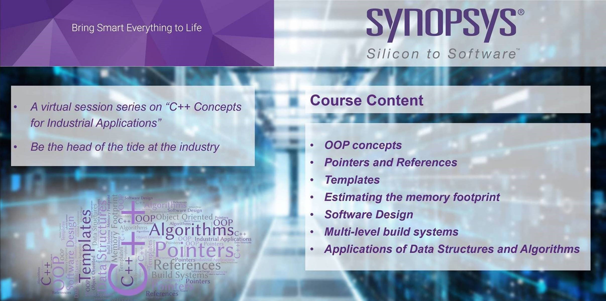

# Cpp-for-Industrial-Applications by Synopsys

 

  
***Synopsys will be conducting a series of virtual sessions on following C++ Concepts for Industrial Applications followed by a hackathon. Certificates will be awarded for the successful completion of the course and winners of the hackathon will be rewarded with attractive prizes.***
  
- OOP concepts
- Pointers and References
- Templates
- Estimating the memory footprint
- Software Design
- Multi-level build systems
- Applications of Data Structures and Algorithms
