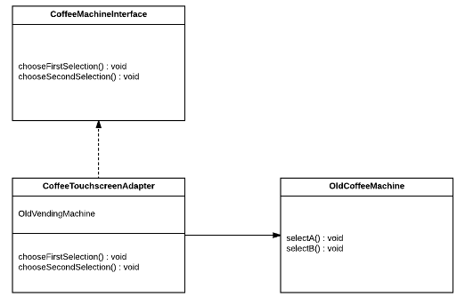

Q1. You are working in an office with an old coffee machine that dispenses
two different coffee flavors. However, the new boss wants to add a new
coffee machine with a touchscreen that can also connect to the old coffee machine.
Complete the provided code to add an adapter so that the new touchscreen will
work with the old coffee machine. Use the following UML(Unified Modeling Language)
class diagram for a guide:

